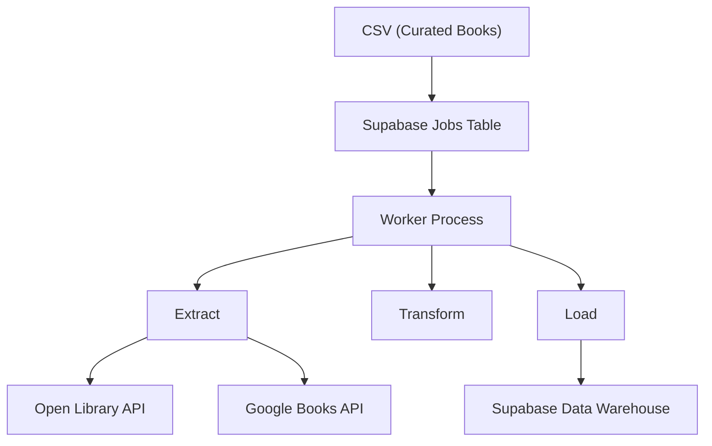
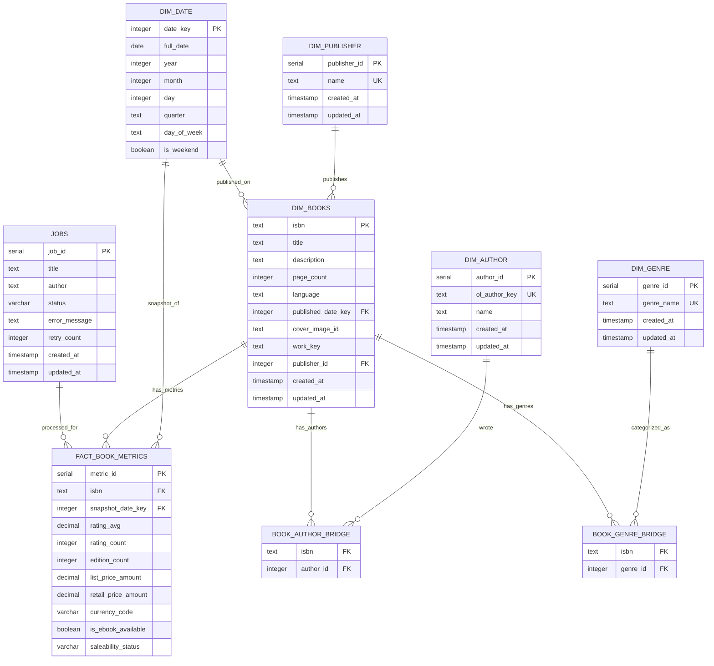

# Project Brief: Books Data Warehouse

## Project Overview
Build a multi-source data warehouse that integrates book data from Open Library and Google Books APIs. This project demonstrates ETL pipeline development, dimensional modeling, and analytical query capabilities - serving as a foundation for future data engineering projects.

- **Duration:** 2-3 days
- **Scope:** Single snapshot data collection with potential for time-series expansion

## Objectives

- Design and implement a dimensional data warehouse schema
- Build an ETL pipeline integrating multiple data sources
- Handle data quality, matching, and transformation challenges
- Enable analytical queries across multiple dimensions
- Create a scalable foundation for future enhancements


## Tech Stack

### Data Sources

- **Open Library API** - Book metadata, editions, authors, subjects
- **Google Books API** - Ratings, categories, publisher info, availability

### Infrastructure

- **Database:** PostgreSQL (Supabase)
- **Job Queue:** PostgreSQL (job status table)
- **Language:** Python 3.x
- **ETL Framework:** Custom scripts with requests library

### Python Libraries

```
requests          # API calls
psycopg2          # PostgreSQL connection
python-dotenv     # Environment variables
pandas            # Data transformation (optional)
logging           # Error tracking
```
```

---

## Architecture



### Data Flow

1. **Publisher** reads CSV of curated books (ISBNs/titles)
2. **Jobs Table** stores pending book processing tasks
3. **Worker** processes each job:
   - Extracts from Open Library API
   - Extracts from Google Books API
   - Transforms and merges data
   - Loads to dimensional tables
4. **Failed jobs** logged for manual review/retry

---

## File Structure

```
books-data-warehouse/
│
├── data/
│   ├── curated_books.csv          # Input: ISBNs or titles to process
│   └── sample_queries.sql         # Example analytical queries
│
├── extractors/
│   ├── __init__.py
│   ├── open_library.py            # Open Library API calls
│   └── google_books.py            # Google Books API calls
│
├── sql/
│   └── schema.sql                 # DDL for all tables (with constraints & indexes)
│
├── config.py                      # Database configs, API settings
├── publisher.py                   # Reads CSV, creates jobs
├── worker.py                      # Main ETL orchestrator
├── transformer.py                 # Data merging and cleaning
├── loader.py                      # Database insert operations
├── requirements.txt               # Python dependencies
├── .env.example                   # Environment variables template
├── README.md                      # Project documentation
└── .gitignore
```

## Database Schema

### Job Management

#### jobs
| Column Name    | Data Type | Nullable | Description |
|----------------|-----------|----------|-------------|
| job_id         | SERIAL    | NOT NULL | Primary key (auto-increment) |
| title          | TEXT      | NOT NULL | Book title from CSV |
| author         | TEXT      | NOT NULL | Book author from CSV |
| status         | VARCHAR(20) | NOT NULL | Job status: 'pending', 'processing', 'completed', 'failed' |
| error_message  | TEXT      | NULL     | Error details if job failed |
| retry_count    | INTEGER   | NOT NULL | Number of retry attempts (default 0) |
| created_at     | TIMESTAMP | NOT NULL | When job was created (default NOW()) |
| updated_at     | TIMESTAMP | NOT NULL | When job was last updated (default NOW()) |

Primary Key: `job_id`

### Dimension Tables

#### dim_books 
| Column Name    | Data Type | Nullable | Description |
|----------------|-----------|----------|-------------|
| isbn           | TEXT      | NOT NULL | Primary key (ISBN-13), unique book identifier |
| title          | TEXT      | NOT NULL | Book title |
| description    | TEXT      | NULL     | Book description/summary |
| page_count     | INTEGER   | NULL     | Number of pages |
| language       | TEXT      | NULL     | Language code (e.g., 'en', 'es') |
| published_date_key | INTEGER   | NULL     | Foreign key to dim_date table |
| cover_image_id | TEXT      | NULL     | ID/reference to cover image |
| work_key       | TEXT      | NULL     | Reference to the work this book belongs to |
| publisher_id   | INTEGER   | NULL     | Foreign key to dim_publisher table |
| created_at     | TIMESTAMP | NOT NULL | When record was created (default NOW()) |
| updated_at     | TIMESTAMP | NOT NULL | When record was last updated (default NOW()) |

Primary Key: `isbn`
Foreign Keys: `published_date_key` → `dim_date.date_key`, `publisher_id` → `dim_publisher.publisher_id`

#### dim_date
| Column Name    | Data Type | Nullable | Description |
|----------------|-----------|----------|-------------|
| date_key       | INTEGER   | NOT NULL | Primary key, format YYYYMMDD (e.g., 20171010) |
| full_date      | DATE      | NOT NULL | Date in YYYY-MM-DD format |
| year           | INTEGER   | NOT NULL | Year (e.g., 2017) |
| month          | INTEGER   | NOT NULL | Month (1-12) |
| day            | INTEGER   | NOT NULL | Day of month (1-31) |
| quarter        | TEXT      | NOT NULL | Quarter (Q1-Q4) |
| day_of_week    | TEXT      | NOT NULL | Day name (e.g., 'Tuesday') |
| is_weekend     | BOOLEAN   | NOT NULL | True if weekend (Saturday or Sunday) |

Primary Key: `date_key`

#### dim_publisher
| Column Name    | Data Type | Nullable | Description |
|----------------|-----------|----------|-------------|
| publisher_id   | SERIAL    | NOT NULL | Primary key (auto-increment) |
| name           | TEXT      | NOT NULL | Publisher's name |
| created_at     | TIMESTAMP | NOT NULL | When record was created (default NOW()) |
| updated_at     | TIMESTAMP | NOT NULL | When record was last updated (default NOW()) |

Primary Key: `publisher_id`
Unique Constraints: `name` (prevents duplicate publishers)

#### dim_author
| Column Name    | Data Type | Nullable | Description |
|----------------|-----------|----------|-------------|
| author_id      | SERIAL    | NOT NULL | Primary key (auto-increment) |
| ol_author_key  | TEXT      | NULL     | Open Library identifier (unique when not NULL) |
| name           | TEXT      | NOT NULL | Author's full name |
| created_at     | TIMESTAMP | NOT NULL | When record was created (default NOW()) |
| updated_at     | TIMESTAMP | NOT NULL | When record was last updated (default NOW()) |

Primary Key: `author_id`
Unique Constraints: `ol_author_key` (deduplication via Open Library identifier)

#### book_author_bridge
| Column Name    | Data Type | Nullable | Description |
|----------------|-----------|----------|-------------|
| isbn           | TEXT      | NOT NULL | Foreign key to dim_books |
| author_id      | INTEGER   | NOT NULL | Foreign key to dim_author |

Primary Key: Composite (`isbn`, `author_id`)
Foreign Keys: `isbn` → `dim_books.isbn`, `author_id` → `dim_author.author_id`

#### dim_genre
| Column Name    | Data Type | Nullable | Description |
|----------------|-----------|----------|-------------|
| genre_id       | SERIAL    | NOT NULL | Primary key (auto-increment) |
| genre_name     | TEXT      | NOT NULL | Genre or category label (e.g., 'Young Adult Fiction') |
| created_at     | TIMESTAMP | NOT NULL | When record was created (default NOW()) |
| updated_at     | TIMESTAMP | NOT NULL | When record was last updated (default NOW()) |

Primary Key: `genre_id`
Unique Constraints: `genre_name` (prevents duplicate genres)

#### book_genre_bridge
| Column Name    | Data Type | Nullable | Description |
|----------------|-----------|----------|-------------|
| isbn           | TEXT      | NOT NULL | Foreign key to dim_books |
| genre_id       | INTEGER   | NOT NULL | Foreign key to dim_genre |

Primary Key: Composite (`isbn`, `genre_id`)
Foreign Keys: `isbn` → `dim_books.isbn`, `genre_id` → `dim_genre.genre_id`

#### fact_book_metrics
| Column Name          | Data Type     | Nullable | Description |
|----------------------|---------------|----------|-------------|
| metric_id            | SERIAL        | NOT NULL | Primary key (auto-increment) |
| isbn                 | TEXT          | NOT NULL | Foreign key to dim_books |
| snapshot_date_key    | INTEGER       | NOT NULL | Foreign key to dim_date (data capture date) |
| rating_avg           | DECIMAL(3,2)  | NULL     | Average rating (e.g., 4.5) |
| rating_count         | INTEGER       | NULL     | Number of ratings |
| edition_count        | INTEGER       | NULL     | Number of editions from Open Library |
| list_price_amount    | DECIMAL(10,2) | NULL     | List price |
| retail_price_amount  | DECIMAL(10,2) | NULL     | Retail/sale price |
| currency_code        | VARCHAR(3)    | NULL     | Currency code (e.g., "PHP", "USD") |
| is_ebook_available   | BOOLEAN       | NOT NULL | Whether eBook is available (default FALSE) |
| saleability_status   | VARCHAR(50)   | NULL     | Sale status (e.g., "FOR_SALE", "NOT_FOR_SALE") |

Primary Key: `metric_id`
Foreign Keys: `isbn` → `dim_books.isbn`, `snapshot_date_key` → `dim_date.date_key`
Unique Constraints: `(isbn, snapshot_date_key)` (one metric per book per snapshot date)

### Database Indexes

The following indexes are created for query performance optimization:

**Fact Table Indexes:**
- `idx_fact_metrics_isbn` - Fast lookup of metrics for specific books
- `idx_fact_metrics_snapshot_date` - Queries across all books for a date
- `idx_fact_metrics_rating` - Sorting/filtering by rating

**Dimension Table Indexes:**
- `idx_books_publisher` - Publisher-level analytics
- `idx_books_published_date` - Temporal analysis
- `idx_books_language` - Language-specific queries
- `idx_author_name` - Author lookup and deduplication
- `idx_author_ol_key` - Open Library identifier lookup
- `idx_genre_name` - Genre deduplication
- `idx_publisher_name` - Publisher deduplication (implicit via UNIQUE)

**Bridge Table Indexes:**
- `idx_book_author_author_id` - Reverse lookup for many-to-many relationships
- `idx_book_genre_genre_id` - Genre-level aggregations

**Date Dimension Index:**
- `idx_date_year_month` - Grouped time queries (year/month analysis)

### Constraints & Unique Keys

All dimension tables include:
- `UNIQUE` constraints on identifying fields to prevent duplicates
- `CHECK` constraints to validate data ranges (e.g., ratings 0-5, positive page counts)
- Foreign key constraints with CASCADE DELETE for referential integrity

### Entity Relationship Diagram



## 15 Analytical Questions

### Rating & Quality Analysis

1. Which genres have the highest average ratings?
2. What is the correlation between number of ratings and average rating?
3. Do books with more editions tend to have higher ratings?
4. Which publishers consistently produce highly-rated books (avg rating > 4.0)?
5. Is there a correlation between page count and rating?

### Market & Popularity Analysis

6. Which authors have the most books in the warehouse?
7. What is the distribution of books by publication decade?
8. Which genres have the most available ebooks?
9. What percentage of books are available as ebooks vs. print only?
10. Which books have the most editions available (across all languages)?

### Publisher & Author Insights

11. Which publishers dominate each genre?
12. What is the average page count by genre?
13. Which authors write across the most genres (genre diversity)?
14. What are the top 10 books with the most editions available?

### Cross-Dimensional Analysis

15. Fiction vs Non-Fiction: Which category has higher average ratings, more editions, and longer page counts?

## Deliverables

### Code
- [ ] Working ETL pipeline (publisher → worker → loader)
- [ ] Error handling and retry logic
- [ ] Data quality validation
- [ ] Logging for debugging
- [ ] Transaction management for data consistency
- [ ] Rate limiting for API calls

### Database
- [ ] Fully normalized dimensional schema (3NF)
- [ ] Sample data (500-2000 books)
- [ ] Foreign key relationships enforced
- [ ] Indexes on all key fields for performance
- [ ] Unique constraints for deduplication
- [ ] Audit fields (created_at, updated_at) on dimensions

### Documentation
- [ ] README with setup instructions
- [ ] Schema diagram (ERD)
- [ ] Sample SQL queries for 15 analytical questions
- [ ] Data dictionary
- [ ] Environment variables documentation

## Optional Enhancements

- [ ] Basic data visualization (charts/graphs)
- [ ] Materialized views for common aggregations
- [ ] API rate limiting handling
- [ ] Incremental load capability
- [ ] Data quality reporting dashboard


## Success Criteria

- **Functional ETL:** Successfully extract, transform, and load data from both APIs
- **Data Quality:** < 5% failed jobs, proper handling of missing data
- **Schema Integrity:** All foreign keys valid, no orphaned records
- **Query Performance:** All 15 analytical queries run in < 5 seconds
- **Scalability:** Architecture can handle 10,000+ books with minor adjustments


## Future Enhancements (Phase 2)

- **Time-Series Analysis:** Schedule weekly ETL runs to track rating trends
- **Additional APIs:** Add NYT Bestseller list, Goodreads data
- **Advanced Analytics:** Recommendation engine, sentiment analysis
- **Orchestration:** Apache Airflow for scheduling
- **Caching Layer:** Add Redis for API response caching
- **Data Visualization:** Build dashboard (Tableau, PowerBI, or Streamlit)


## Timeline

### Day 1:
- [ ] Set up Supabase database
- [ ] Create complete schema with constraints and indexes
- [ ] Build publisher.py and basic worker.py
- [ ] Test Open Library API extraction

### Day 2:
- [ ] Integrate Google Books API
- [ ] Build transformer.py (data merging logic with deduplication)
- [ ] Complete loader.py (with transactions)
- [ ] Process 500-1000 books

### Day 3:
- [ ] Expand to 1500-2000 books
- [ ] Write and test all 15 analytical queries
- [ ] Create documentation and setup guide
- [ ] Handle edge cases and data quality issues
- [ ] Performance testing and index optimization

